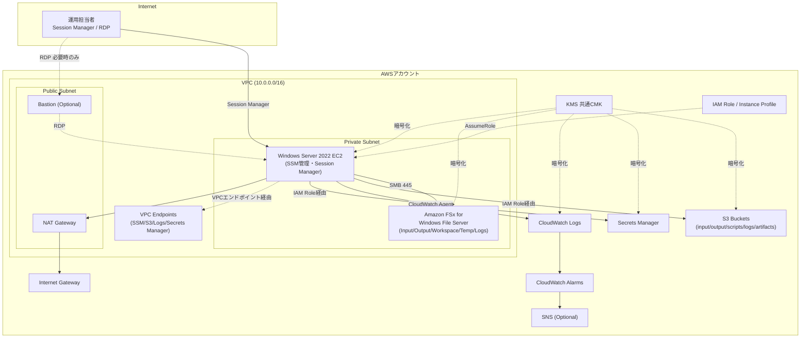

# tf-win: Windowsデスクトップアプリケーション実行基盤 (Terraform)

Windows上で動作するデスクトップアプリケーション(CAD/CAE/解析ソフト/RPA対象アプリ/
社内業務アプリ等)をAWS上で実行するための基盤をTerraformで構築するプロジェクトです。

**本Terraformの責務はインフラ構築までです。** 対象アプリケーションのインストールや
Python・PowerShell・.NET・Visual C++ Runtime・Anacondaなどの実行環境構築は、
[scripts/](./scripts) に配置する初期セットアップスクリプト(PowerShell等)で別途行います。

---

## 目次

1. [システム概要](#システム概要)
2. [前提ソフトウェア](#前提ソフトウェア)
3. [AWS認証情報の設定方法](#aws認証情報の設定方法)
4. [Terraform実行方法](#terraform実行方法)
5. [トラブルシューティング](#トラブルシューティング)
6. [設計判断理由 / 採用しなかった構成案](#設計判断理由--採用しなかった構成案)
7. [将来拡張](#将来拡張)

---

## システム概要

### アーキテクチャ図



### 利用サービス

| サービス | 用途 |
|---|---|
| VPC / Subnet / IGW / NAT Gateway / Route Table | ネットワーク基盤 |
| VPC Endpoint (Interface/Gateway) | Private SubnetからNATを介さずSSM/S3等へ接続 |
| EC2 (Windows Server 2022) | デスクトップアプリケーション実行基盤 |
| Amazon FSx for Windows File Server | SMB共有ストレージ (Input/Output/Workspace/Temp/Logs) |
| Systems Manager (SSM) | Session Manager管理、Run Command/State Managerによるスクリプト実行 |
| CloudWatch Logs / Agent / Alarm | Windows Event Log・PowerShellログ等の収集、CPU/メモリ/ディスク/FSx監視 |
| Secrets Manager | アプリケーション認証情報の安全な管理 |
| KMS | EBS/S3/FSx/Secrets Manager/CloudWatch Logsの暗号化 |
| S3 | input/output/scripts/logs/artifacts用バケット |
| IAM Role / Instance Profile | EC2への最小権限付与 |
| SNS (オプション) | アラーム通知 |
| EventBridge | EC2停止検知・SSM Compliance異常検知 |

### ディレクトリ構成

```
tf-win/
├── modules/
│   ├── network/      # VPC, Subnet, IGW, NAT, Route Table, VPC Endpoint
│   ├── ec2/           # Windows EC2, UserData
│   ├── fsx/           # FSx for Windows File Server
│   ├── s3/            # S3バケット群
│   ├── iam/           # IAM Role / Instance Profile / 最小権限ポリシー
│   ├── monitoring/    # CloudWatch Alarm, SNS, EventBridge
│   ├── security/      # KMS, Security Group, Secrets Manager
│   ├── logging/       # CloudWatch Logsロググループ
│   └── ssm/           # SSMドキュメント, State Manager Association
├── environments/
│   ├── dev/           # dev環境 (backend, tfvars)
│   ├── stg/           # stg環境
│   └── prod/          # prod環境
├── scripts/           # 初期セットアップスクリプト配置場所(本Terraformの管理外)
├── main.tf            # ルートモジュール(各サブモジュールの結線)
├── variables.tf
├── outputs.tf
├── locals.tf
├── versions.tf
└── README.md
```

`environments/<env>` はルートモジュール(`main.tf`)を呼び出す薄いラッパーです。
環境固有の値(backend設定、tfvars)のみを持ち、リソース定義自体は `modules/` に
集約することで環境間の差分を最小化し、保守性を高めています。

### 設計方針

- **モジュール化の徹底**: 責務ごとにモジュールを分割し、再利用性・可読性を高める。
- **変数化・locals活用**: ハードコードを避け、タグは `locals.common_tags` で一元管理。
- **最小権限**: IAM Roleは必要なアクション・リソースのみを許可。
- **Session Manager優先**: RDPを常時開放せず、SSM Session Managerによる管理を基本とする。
- **暗号化の徹底**: EBS/S3/FSx/Secrets Manager/CloudWatch Logsを共通KMS CMKで暗号化。
- **アプリケーション非依存**: 特定アプリケーションに依存する実装・命名を避け、
  任意のWindows GUIアプリケーションに対応できる汎用基盤とする。
- **セットアップ処理の責務分離**: Terraformはスクリプトを実行可能な状態にするまでとし、
  スクリプトの中身(ランタイム導入等)は運用チームが管理する。

---

## 前提ソフトウェア

| ソフトウェア | 用途 | 参考バージョン |
|---|---|---|
| [Terraform](https://developer.hashicorp.com/terraform/install) | IaC実行 | >= 1.9.0 |
| [AWS CLI](https://docs.aws.amazon.com/cli/latest/userguide/getting-started-install.html) | AWS認証・操作補助 | v2系 |
| [Git](https://git-scm.com/) | バージョン管理 | 最新 |
| PowerShell | セットアップスクリプト作成・Session Manager経由の操作 | 5.1以降 / PowerShell 7 |
| [Session Manager plugin](https://docs.aws.amazon.com/systems-manager/latest/userguide/session-manager-working-with-install-plugin.html) | `aws ssm start-session` のCLI利用 | 最新 |
| (推奨) [tflint](https://github.com/terraform-linters/tflint) | Terraform静的解析 | 最新 |
| (推奨) [tfsec](https://github.com/aquasecurity/tfsec) | Terraformセキュリティスキャン | 最新 |

---

## AWS認証情報の設定方法

### Windows

#### AWS CLIインストール

1. [AWS CLI公式インストーラ (MSI)](https://awscli.amazonaws.com/AWSCLIV2.msi) をダウンロードして実行する。
2. インストール後、コマンドプロンプトまたはPowerShellで確認する。

   ```powershell
   aws --version
   ```

#### `aws configure` の実行方法

```powershell
aws configure --profile myprofile-dev
```

対話式でAccess Key ID / Secret Access Key / Default region name / Default output format を入力する。

#### 認証情報の保存場所

- `C:\Users\<User>\.aws\credentials`
- `C:\Users\<User>\.aws\config`

`credentials` にはアクセスキー等の機微情報、`config` にはリージョンやプロファイル固有の設定
(SSO設定含む)が保存される。

#### 環境変数を利用する方法

PowerShellの例:

```powershell
$env:AWS_ACCESS_KEY_ID = "AKIA..."
$env:AWS_SECRET_ACCESS_KEY = "..."
$env:AWS_SESSION_TOKEN = "..."   # 一時認証情報利用時のみ
$env:AWS_DEFAULT_REGION = "ap-northeast-1"
```

#### IAM Identity Center (旧AWS SSO) を利用する方法

```powershell
aws configure sso
```

プロンプトに従いSSO開始URL・リージョン・ロールを選択する。`~/.aws/config`
(Windowsでは `C:\Users\<User>\.aws\config`) に `sso_session` を含むプロファイルが作成される。

```powershell
aws sso login --profile myprofile-sso
```

#### 複数Profileの利用方法

`~/.aws/credentials` や `~/.aws/config` に `[profile1]`, `[profile2]` のように
複数プロファイルを定義できる。

#### Terraform実行時に利用するProfileの指定方法

本プロジェクトでは `aws_profile` 変数でプロファイルを指定する(`environments/<env>/terraform.tfvars`)。

```hcl
aws_profile = "myprofile-dev"
```

または環境変数で上書きすることも可能:

```powershell
$env:AWS_PROFILE = "myprofile-dev"
terraform plan
```

---

### macOS

#### AWS CLIインストール

Homebrewでのインストール例:

```bash
brew install awscli
aws --version
```

または[公式pkgインストーラ](https://awscli.amazonaws.com/AWSCLIV2.pkg)を利用する。

#### `aws configure` の実行方法

```bash
aws configure --profile myprofile-dev
```

#### 認証情報の保存場所

- `~/.aws/credentials`
- `~/.aws/config`

#### 環境変数を利用する方法

```bash
export AWS_ACCESS_KEY_ID="AKIA..."
export AWS_SECRET_ACCESS_KEY="..."
export AWS_SESSION_TOKEN="..."   # 一時認証情報利用時のみ
export AWS_DEFAULT_REGION="ap-northeast-1"
```

#### IAM Identity Center (旧AWS SSO) を利用する方法

```bash
aws configure sso
aws sso login --profile myprofile-sso
```

#### 複数Profileの利用方法

`~/.aws/credentials`, `~/.aws/config` に複数の `[profile]` セクションを定義し、
`--profile` オプションやAWS_PROFILE環境変数で切り替える。

#### Terraform実行時のProfile指定方法

```bash
export AWS_PROFILE=myprofile-dev
terraform plan
```

または `terraform.tfvars` の `aws_profile` 変数で指定する。

---

### セキュリティ上の注意事項

- **credentialsファイルはGit管理しない。** `.gitignore` で `.aws/`, `credentials`, `config`
  を除外している(本リポジトリの [.gitignore](./.gitignore) 参照)。
- **Access KeyをTerraformコードへ直接記述しない。** `provider "aws"` ブロックに
  `access_key` / `secret_key` を書かず、必ずプロファイルや環境変数、IAMロール経由で認証する。
- **`.gitignore` 例** (抜粋、詳細は [.gitignore](./.gitignore) 参照):

  ```gitignore
  *.tfvars
  !*.tfvars.example
  *.tfstate
  *.tfstate.*
  .terraform/
  .aws/
  credentials
  config
  ```

- **IAMユーザーではなくIAM Identity Center利用を推奨する理由**: 長期の固定Access Keyを
  払い出す必要がなく、多要素認証・一時認証情報の自動失効・一元的なアクセス管理が可能なため、
  漏洩時のリスクと運用負荷を大幅に低減できる。
- **本番環境では長期Access Keyよりも一時認証情報を推奨する理由**: 一時認証情報
  (STSトークン、SSO、IAM Role AssumeRole等)は有効期限が短く、漏洩時の被害範囲が
  限定される。CI/CDではOIDC連携によるロールAssumeを推奨する。
- **Secrets ManagerとTerraformの役割分担**: Terraformはシークレットの「箱」
  (Secrets Managerリソースそのもの、KMS暗号化設定、IAMアクセス権限)を作成するに留め、
  実際の機密値(パスワード・APIキー等)はplaceholderとして作成し、
  `aws secretsmanager put-secret-value` 等で運用担当者が別途投入する設計とする。
  これによりtfstate・Gitリポジトリに機微情報が平文で残ることを防ぐ。

---

## Terraform実行方法

### 事前準備: リモートステート用S3バケット/DynamoDBテーブル

各 `environments/<env>/main.tf` の `backend "s3"` ブロックは、事前に用意した
S3バケットとDynamoDBテーブル(ステートロック用)を参照する設計です。
初回利用時は以下のようなリソースを別途(本プロジェクト外で)作成し、
`bucket` / `dynamodb_table` の値を書き換えてください。

```bash
aws s3api create-bucket --bucket your-tfstate-bucket --region ap-northeast-1 \
  --create-bucket-configuration LocationConstraint=ap-northeast-1
aws dynamodb create-table --table-name your-tfstate-lock \
  --attribute-definitions AttributeName=LockID,AttributeType=S \
  --key-schema AttributeName=LockID,KeyType=HASH \
  --billing-mode PAY_PER_REQUEST
```

### tfvarsファイルの準備

```bash
cd environments/dev
cp terraform.tfvars.example terraform.tfvars
# 環境に合わせて値を編集する
```

### 初回: `terraform init`

```bash
cd environments/dev
terraform init
```

### 確認: `terraform plan`

```bash
terraform plan -var-file=terraform.tfvars
```

### 構築: `terraform apply`

```bash
terraform apply -var-file=terraform.tfvars
```

### 削除: `terraform destroy`

```bash
terraform destroy -var-file=terraform.tfvars
```

> **注意**: `s3_force_destroy = true` でない限り、バケット内にオブジェクトが
> 残っているとdestroyは失敗します。本番運用ではバケットの誤削除防止のため
> 意図的に `false` としています。

### Workspace利用例

環境ごとに `environments/<env>` ディレクトリを分離しているため、
Terraform Workspace機能は必須ではありませんが、同一環境内でさらに
分離したい場合(例: 一時的な検証用スタック)は以下のように利用できます。

```bash
terraform workspace new feature-x
terraform workspace select feature-x
terraform plan -var-file=terraform.tfvars
```

### Profile指定例

```bash
# 環境変数での指定
export AWS_PROFILE=myprofile-dev
terraform plan

# tfvarsでの指定 (aws_profile変数)
terraform plan -var-file=terraform.tfvars
```

### variables指定例

```bash
terraform apply -var-file=terraform.tfvars \
  -var="ec2_instance_type=m5.2xlarge" \
  -var="enable_rdp_access=true" \
  -var='rdp_allowed_cidrs=["203.0.113.10/32"]'
```

### tfvars利用例

`environments/<env>/terraform.tfvars.example` を参照してください。
主要な変数の意味は [variables.tf](./variables.tf) のdescriptionを参照してください。

---

## トラブルシューティング

| エラー | 原因 / 対処 |
|---|---|
| `Error: Backend initialization required, please run "terraform init"` | backend設定変更後は `terraform init -reconfigure` を実行する。 |
| `Error: error configuring S3 Backend: ... NoCredentialProviders` | AWS認証情報が設定されていない。`aws configure` またはプロファイル/環境変数を確認する。 |
| `Error: creating FSx ... InvalidParameterCombination` | FSx for Windows File ServerはActiveDirectory参加が必須。`fsx_self_managed_active_directory` 変数を設定するか、AD未整備の場合は `enable_fsx = false` にする。 |
| EC2にSession Managerで接続できない | ①IAM RoleにAmazonSSMManagedInstanceCoreがアタッチされているか、②Private SubnetからSSMエンドポイント(VPCエンドポイントまたはNAT経由)に到達できるか、③SSM Agentが起動しているか(数分待ってから再試行)を確認する。 |
| UserDataでのセットアップスクリプトが実行されない | `setup_script_execution_mode = "userdata"` になっているか、`scripts` バケットに指定した `setup_script_s3_key` が実在するか確認する。EC2の `C:\ProgramData\Amazon\setup-userdata.log` を確認する。 |
| `terraform plan` で毎回EC2が再作成される | AMI更新等が原因の場合は `modules/ec2` の `lifecycle.ignore_changes` でAMI変更を無視する設定を入れている。他の属性(サブネット等)の差分がないか確認する。 |
| `Error: "egress.0.description" doesn't comply with restrictions` | AWSのSecurity Group ルールの説明文は英数字と一部記号のみ許可される。日本語を含めないこと(本プロジェクトでは既に英語化済み)。 |
| S3バケット名が重複してcreateに失敗する | バケット名はグローバルに一意である必要がある。本プロジェクトはアカウントIDをバケット名に付与しているが、それでも衝突する場合は `s3_bucket_names` のサフィックスを変更する。 |

---

## 設計判断理由 / 採用しなかった構成案

### FSx for Windows File Server を採用した理由

Windowsアプリケーションからは通常のSMB共有として認識でき、既存のWindows運用ノウハウを
そのまま活用できるため採用した。代替として **Amazon EFS** も検討したが、EFSはNFS
ベースでありWindowsからのネイティブSMBアクセスに標準対応しないため見送った。
ただし、FSx for Windows File ServerはActiveDirectory参加が必須という制約があるため、
AD未整備環境向けに `enable_fsx = false` でスキップ可能な設計とした。

### Session Manager優先、RDP常時開放を避けた理由

RDP(3389)の常時開放はインターネットからのブルートフォース攻撃・脆弱性悪用のリスクが
高い。Session Managerであれば、IAMベースの認可・CloudTrailによる操作証跡・
インバウンドポート開放不要という利点があるため、既定の管理手段とした。
RDPは運用上どうしても必要な場合のみ `enable_rdp_access` で限定的に有効化できる設計とし、
踏み台構成(`enable_bastion`)にも対応した。

### VPC Endpoint を導入した理由

Private SubnetからSSM/S3/CloudWatch Logs/Secrets Managerへの通信を、
NAT Gateway経由(インターネット向け経路)ではなくVPC内で完結させることで、
セキュリティ(不要なインターネット露出の回避)とコスト(NAT Gatewayのデータ転送料削減)
の両方を改善できるため採用した。小規模検証環境ではコスト増となるため
`enable_vpc_endpoints` でオプション化した。

### セットアップスクリプトの実行方式を3種類サポートした理由

- `userdata`: シンプルで初回起動時の自動化に適するが、後から再実行するには
  インスタンス再作成が必要になりがちで柔軟性に欠ける。
- `ssm_run_command`: 任意タイミングで手動/CI経由で実行でき、運用中の再セットアップや
  修正パッチ適用に向く。
- `state_manager`: 継続的なコンプライアンス維持(ドリフト自動是正)に向くが、
  意図せず再実行されるリスクもある。

用途に応じて切り替えられるよう変数化し、特定の一方式に固定しない設計とした。

### 採用しなかった構成案

- **AWS Managed Microsoft ADの自動構築**: FSxのAD参加要件を満たすために本来は
  Managed Microsoft ADも本プロジェクトに含めることが望ましいが、AD構成は
  既存のオンプレミスAD/他プロジェクトで管理されているケースが多く、
  汎用基盤としては「外部から接続情報を受け取る」設計の方が柔軟性が高いと判断し、
  `fsx_self_managed_active_directory` 変数経由で外部提供する設計とした
  (将来的にモジュールとして追加可能)。
- **Auto Scaling Group によるEC2管理**: デスクトップアプリケーションは
  ステートフルな作業環境(ユーザーセッション・ローカルデータ)であることが多く、
  スケールアウト/インによるインスタンス入れ替えとは相性が悪いため、
  現時点では固定台数のEC2(`ec2_instance_count`)とした。
  マルチユーザー化などの要件があれば将来拡張でASGを追加できる。
- **CloudFrontやALBの導入**: 対象がデスクトップGUIアプリケーション(RDP/SSMで
  直接操作)であり、HTTPロードバランシングの必要性がないため見送った。
  将来、Webベースの管理画面等を追加する場合はALBを追加できる設計としている。
- **Terraformによるスクリプト内容の直接記述**: bootstrap.ps1等の中身を
  Terraformのheredocやtemplatefileで管理する案もあったが、アプリケーション
  ごとに大きく異なる内容をTerraformのライフサイクルに巻き込むと、
  些細なスクリプト変更のたびにTerraformの差分・レビューが必要になり保守性が
  低下するため、スクリプト自体は別リポジトリ/別ファイルとして管理し、
  Terraformは「配置・実行できる状態にする」ことに専念する設計とした。

---

## 将来拡張

以下の要件は本プロジェクトの構成(モジュール分割・変数化)を維持したまま、
モジュール追加や変数拡張で対応できます。

- **GPUインスタンス**: `ec2_instance_type` をGPUインスタンスタイプ(g4dn等)に
  変更するだけで対応可能(ドライバ導入はセットアップスクリプト側)。
- **Auto Scaling / 複数Windowsサーバー**: `ec2_instance_count` は既に複数台数対応済み。
  ASG化する場合は `modules/ec2` を Launch Template + ASG構成に拡張する。
- **Step Functions / EventBridge / Lambda / AWS Batch**: `modules/monitoring` に
  既にEventBridge Ruleの実装例があるため、同様のパターンで追加可能。
- **S3イベント**: `modules/s3` のバケットに `aws_s3_bucket_notification` を追加するだけで対応可能。
- **AWS Managed Microsoft AD / ドメイン参加**: `modules/fsx` は既に
  `self_managed_active_directory` ブロックで外部AD接続に対応済みのため、
  Managed AD構築モジュールを追加し出力値を渡すだけで統合できる。
- **GitHub Actions / CodePipeline / CodeBuild**: 本プロジェクトはtfvarsとbackendを
  環境ごとに分離済みのため、CI/CDパイプラインからは
  `terraform plan/apply -var-file=environments/<env>/terraform.tfvars` を
  実行するだけで組み込み可能。
- **Application Load Balancer**: `modules/network` のPublic Subnetを活用し、
  新規モジュールとして追加可能。
- **ライセンスサーバー追加/複数アプリケーションの同居**: 本基盤はアプリケーション
  非依存設計のため、追加のEC2インスタンス(`ec2_instance_count`増加)や
  S3/FSxの追加フォルダ(`fsx_shared_folders`)で対応可能。
